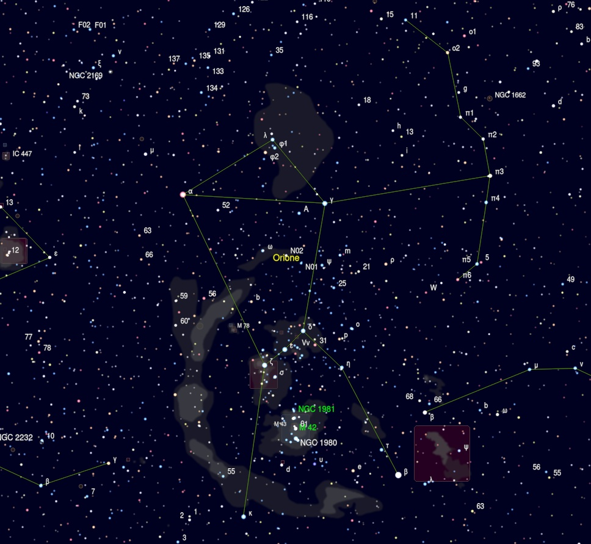

# Primo report

## Premessa

Oggi 21/03/2023 mi accingo a scrivere il mio primo report da visualista. 

Un’importante premessa, la mia avventura da astrofilo ha avuto inizio un paio di anni fa circa (qualcosina in più forse) con l’astrofotografia che mi ha dato e continua a darmi soddisfazioni. Per me, sviluppatore software per passione prima e lavoro poi, è stato un passaggio abbastanza naturale: la mia praticità con lo strumento informatico ha aiutato molto e portato a discreti risultati in un lasso di tempo abbastanza breve. Ho letteralmente divorato video-tutorial, articoli, passato giorni a capire come risolvere i problemi più svariati, ad ottimizzare il setup a lavorare sulle procedure di elaborazione, insomma tutta quell’esperienza che un astrofotografo ha nel proprio bagaglio e che si  evolve continuamente.

Col trascorrere del tempo mi sono accorto però di avere delle mancanze che l’astrofotografia non poteva colmare, almeno nel mio caso: ho foto dettagliate dei soggetti che decido di catturare, per carità, immagini che i miei occhi non riuscirebbero mai e poi mai a recepire con colori sfavillanti e particolari impressionanti. Ma non mi ero accorto, sommerso dal rumore della tecnica, di non avere quel contatto diretto con il cielo che avevo sempre cercato, molto spesso inconsciamente, mettendomi sul balcone con un treppiede e il mio Mak 90, osservando e riosservando la Luna, Giove, Saturno, M42, M45… Un contatto scevro della modernità, puro, conoscitivo, introspettivo, mistico a tratti.

Ho deciso di fare il passo successivo quindi, ho acquistato un Dobson Explore Scientific 305/1525 ed è così iniziata una nuova avventura.

## La serata

sabato 18 marzo 2023

Ci tenevo molto a questa serata, non sapevo cosa

### Costellazione di Orione - Ori

| Catalogo Messier | Catalogo NGC | Nome | Tipologia | Magnitudine apparente | Dimensione apparente
| ----------- | ----------- | ----------- | ----------- | ----------- | ----------- |
| M42 | NGC 1976 | Nebulosa di Orione | Nebulosa diffusa | 4 | 65' × 60' |
|  | NGC 1981 |  | Ammasso Aperto | 4,2 | 28' |

Ho iniziato con un classico che non volevo farmi sfuggire, anche se ormai fuori periodo. Ho puntato subito ad M42, non mi stanco mai nel vederla. Volevo inoltre confrontare ciò che ho visto sul terrazzo di casa nella serata di test del telescopio rispetto al cielo del Pollino, decisamente migliore. La nebulosa ai miei occhi appariva di un colore verdastro, rispetto alla visione "casalinga" ho notato un maggior contrasto e una ricchezza maggiore di particolari, il miglior equilibrio tra luminosita e dettagli l'ho avuto a 73x. Successivamente mi sono spostato e ho localizzato subito l'ammasso NGC 1981, in cui, facendo un po' di attenzione, erano presenti delle tenui nebulosità.

### Costellazione del Toro - Tau

| Catalogo Messier | Catalogo NGC | Nome | Tipologia | Magnitudine apparente | Dimensione apparente
| ----------- | ----------- | ----------- | ----------- | ----------- | ----------- |
| M45 |  | Pleiadi | Ammasso aperto | 1,6 | 150' |
|  | NGC 1647 | | Ammasso aperto | 6,38 | 27' |
|  | NGC 1746 | | Ammasso aperto | 6,09 | 18' |

Ho voluto continuare il riscaldamento, puntando alle Pleiadi: trovate facilmente. A 48x, ovviamente, l'ammasso non ci entrava, mi sono letteralmente perso al suo interno! Visibili anche qui tenui nebulosità accanto alle stelle più luminose.
NGC 1647 e NGC 1746, in tutta sincerità, non mi hanno impressionato particolarmente, anche se complessivamente entrambi gradevoli. Mi sono ripromesso di rivederli successivamente con più esperienza e migliori capacità di analisi.

### Costellazione dell'Orsa Maggiore - UMa

| Catalogo Messier | Catalogo NGC | Nome | Tipologia | Magnitudine apparente | Dimensione apparente
| ----------- | ----------- | ----------- | ----------- | ----------- | ----------- |
| M81 | NGC 3031 | Galassia di Bode | Galassia a spirale | 6,8 | 26' × 14' |
| M82 | NGC 3034 | Galassia Sigaro | Galassia starburst | 9,3 | 11,2' × 4,3' |
| M108 | NGC 3556 | Galassia Surfboard | Galassia a spirale | 10 | 8,3' × 2,5' |
| M97 | NGC 3587 | Nebulosa Civetta o Gufo | Nebulosa Planetaria | 9,9 | 3,4' x 3,3' |
| M109 | NGC 3992 | | Galassia a spirale barrata | 9,8 | 7,6' × 4,9' |
| M101 | NGC 5457 | Galassia Girandola | Galassia a spirale | 8,3 | 28,8' × 26,9' |

Qui le cose hanno iniziato a farsi decisamente più interessanti. 