# Primo report

Oggi 21/03/2023 mi accingo a scrivere il mio primo report da visualista. 

Un’importante premessa, la mia avventura da astrofilo ha avuto inizio un paio di anni fa circa (qualcosina in più forse) con l’astrofotografia che mi ha dato e continua a darmi soddisfazioni. Per me, sviluppatore software di professione, è stato un passaggio abbastanza naturale: la praticità con lo strumento informatico ha aiutato molto e portato a discreti risultati in un lasso di tempo abbastanza breve. Ho letteralmente divorato video-tutorial, articoli, passato giorni a capire come risolvere i problemi più svariati, ad ottimizzare il setup a lavorare sulle procedure di elaborazione, insomma tutta quell’esperienza che un astrofotografo ha nel proprio bagaglio e che si evolve continuamente.

Col trascorrere del tempo mi sono accorto però di avere delle mancanze che l’astrofotografia non poteva colmare, almeno nel mio caso: ho foto dettagliate dei soggetti che decido di catturare, per carità, immagini che i miei occhi non riuscirebbero mai e poi mai a recepire con colori sfavillanti e particolari impressionanti. Ma non mi ero accorto, sommerso dal rumore della tecnica, di non avere quel contatto diretto con il cielo che avevo sempre cercato, molto spesso inconsciamente, mettendomi sul balcone con un treppiede e il mio Mak 90 osservando e riosservando la Luna, Giove, Saturno, M42, M45… Un contatto scevro della modernità, puro, conoscitivo, introspettivo, mistico a tratti.

Ho deciso di fare il passo successivo quindi, ho acquistato un Dobson Explore Scientific 305/1525 ed è così iniziata una nuova avventura.

## La serata

Sabato 18 marzo 2023

Ci tenevo particolarmente a questa serata, ero parecchio in ritardo sulla mia personale tabella di marcia. 
Era la mia prima uscita ufficiale da visualista e la mia prima volta sotto il cielo del Pollino.
Sono arrivato per ultimo: Oronzo, Francesco e Nicola erano già disposti e intenti a preparare i loro setup. Ho parcheggiato lato visualisti, accanto a Francesco ed ho iniziato a montare il mio telescopio.

Il cielo era terso, appena arrivato il crepuscolo le stelle iniziavano a mostrarsi: è sempre stupefacente ed emozionante per me guardare un cielo così ricco dove le costellazioni sono facilmente distinguibili, i cieli cittadini ci hanno privato di tutta questa bellezza.

La serata è iniziata alle 19.45 circa e terminata intorno alle 4. 

Il tutto è trascorso velocemente ed in piacevole compagnia, i momenti di pura osservazione individuale erano intervallati da momenti gioviali e scambi di opinioni in cui Francesco ed Oronzo, che ringrazio, si prodigavano a darmi consigli e a correggermi senza far minimante pesare la mia inesperienza. 

Non avevo grandi aspettative, devo essere sincero, avendo testato il telescopio sotto il mio cielo avevo constatato le mie scarse capacità nella tecnica dello star hopping ma mi ero comunque fatto un piano osservativo che ho parzialmente disatteso. C'è da dire anche che con un buon cielo tutto è più semplice il che può sembrare un'ovvietà, ma è una cosa che si comprende a pieno con l'esperienza diretta.

Il bottino comunque è stato proficuo ed inaspettato, sono riuscito a portare a casa:

- 1 Nebulosa diffusa
- 6 Ammassi aperti
- 19 Galassie
- 5 Ammassi globulari
- 2 Nebulose planetarie

L'attrezzatura utilizzata durante la serata era così composta:

- Telescopio Dobson Explore Scientific Truss 305/1525
- Cercatore 8x50
- Oculare 1,25" Baader Classic Ploss 32 MM 52°
- Oculare 1,25" Zoom Svbony SV135 7-21 MM  40°
- Oculare retroilluminato con crocicchio
- Filtri CLS e UHC Svbony
- Laser verde molesto

Per praticità ho suddiviso gli oggetti visti per costellazione.

### Orione - Ori

| | Catalogo Messier | Catalogo NGC | Nome | Tipologia | Magnitudine apparente (v) | Dimensione apparente (v)
| ----------- | ----------- | ----------- | ----------- | ----------- | ----------- | ----------- |
| | M42 | NGC 1976 | Nebulosa di Orione | Nebulosa diffusa | 4 | 65' × 60' |
| | NGC 1981 |  | Ammasso Aperto | 4,2 | 28' |

Ho iniziato con un classico che non volevo farmi sfuggire, anche se ormai fuori periodo. Ho puntato subito ad M42, non mi stanco mai nel vederla. Volevo inoltre confrontare ciò che ho visto sul terrazzo di casa nella serata di test del telescopio rispetto al cielo del Pollino decisamente migliore. La nebulosa ai miei occhi appariva di un colore verdastro, rispetto alla visione "casalinga" ho notato un maggior contrasto e una ricchezza maggiore di particolari, il miglior equilibrio tra luminosita e dettagli l'ho avuto a 73x. Successivamente mi sono spostato e ho localizzato subito l'ammasso NGC 1981 in cui, facendo un po' di attenzione, erano presenti delle tenui nebulosità.

### Toro - Tau

| | Catalogo Messier | Catalogo NGC | Nome | Tipologia | Magnitudine apparente (v) | Dimensione apparente (v)
| ----------- | ----------- | ----------- | ----------- | ----------- | ----------- | ----------- |
|  | M45 |  | Pleiadi | Ammasso aperto | 1,6 | 150' |
|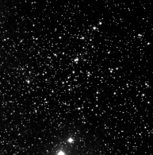 | | NGC 1647 | | Ammasso aperto | 6,38 | 27' |
|| | NGC 1746 | | Ammasso aperto | 6,09 | 18' |

Ho voluto continuare il riscaldamento, puntando alle Pleiadi: trovate facilmente. A 48x, ovviamente, l'ammasso non ci entrava, mi sono letteralmente perso al suo interno! Visibili anche qui tenui nebulosità accanto alle stelle più luminose.
NGC 1647 e NGC 1746, in tutta sincerità, non mi hanno impressionato particolarmente anche se complessivamente entrambi gradevoli. Mi sono ripromesso di rivederli successivamente con più esperienza e migliori capacità di analisi.

### Orsa Maggiore - UMa

| | Catalogo Messier | Catalogo NGC | Nome | Tipologia | Magnitudine apparente (v) | Dimensione apparente (v)
| ----------- | ----------- | ----------- | ----------- | ----------- | ----------- | ----------- |
| | M81 | NGC 3031 | Galassia di Bode | Galassia a spirale | 6,8 | 26' × 14' |
|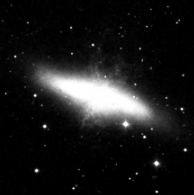 | M82 | NGC 3034 | Galassia Sigaro | Galassia starburst | 9,3 | 11,2' × 4,3' |
| | M108 | NGC 3556 | Galassia Surfboard | Galassia a spirale | 10 | 8,3' × 2,5' |
|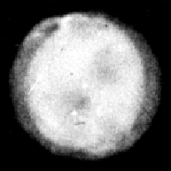  | M97 | NGC 3587 | Nebulosa Civetta o Gufo | Nebulosa Planetaria | 9,9 | 3,4' x 3,3' |
|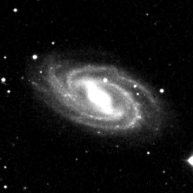 | M109 | NGC 3992 | | Galassia a spirale barrata | 9,8 | 7,6' × 4,9' |
| | M101 | NGC 5457 | Galassia Girandola | Galassia a spirale | 8,3 | 28,8' × 26,9' |

Qui le cose hanno iniziato a farsi decisamente più interessanti. Ho voluto iniziare subito con la coppia M81 - M82, trovate dopo qualche tentativo. Tra le due M82 mi ha letteralmente entusiasmato, l'ho messa tra gli oggetti preferiti della serata. Era facilmente distinguibile la sua forma affusolata con delle piccole zone più scure al centro, di M81 invece riuscivo ad intuire la forma a spirale. Ho tentato successivamente con M101. I primi tentativi nel cercala sono falliti, ci sono tornato più tardi e sono riuscito con un po' di difficoltà a trovarla. Sono passato poi ad M108, anche lei molto bella, ne distinguevo tranquillamente la forma e forse dopo aver abituato gli occhi qualche dettaglio superficiale. 
È arrivato poi il turno di m97, altro oggetto davvero interessante. Ai miei occhi si presentava inizialmente come una sfera, leggermente irregolare, abituando un po' la vista si riuscivano ad intravedere gli occhi della civetta, molto evanescenti. Ho aggiunto un filtro UHC, ne scuriva la superficie e aumentandone leggermente il contrasto miglioravano leggermente i dettagli. Ho provato poi con un filtro OIII gentilmente prestatomi da Oronzo ma per il mio gusto personale la visione ne risultava troppo scura.

### Cani da Caccia - Cvn

| | Catalogo Messier | Catalogo NGC | Nome | Tipologia | Magnitudine apparente (v) | Dimensione apparente (v)
| ----------- | ----------- | ----------- | ----------- | ----------- | ----------- | ----------- |
|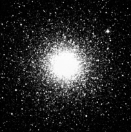  |M3 | NGC 5272 | | Ammasso globulare | 6,2 | 18' |
|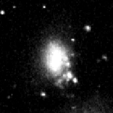  || NGC 4485 | | Galassia irregolare | 11,93 | |
|  || NGC 4490 |  Cocoon Galaxy | Galassia a spirale barrata | 9,8 | 6,3' x 3,1' |
| |M94 | NGC 4736 | | Galassia a spirale | 9,0 | 11.2' × 9.1' |
|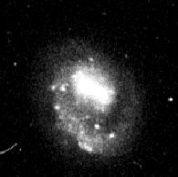 || NGC 4618 | | Galassia a spirale barrata | 11,2 | 4,2' × 3,4' | 
|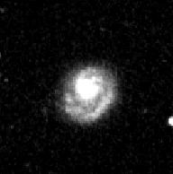 || NGC 4625 | | Galassia nana | 13,2 | 1.3' × 1.2' |

Dopo essermi divertito sull'Orsa avevo necessità di riposarmi un po'. Ho deciso quindi di puntare ad m3 risultata facilmente individuabile e ne sono rimasto davvero stupefatto. L'avevo osservato tempo fa con il 200/800 ma a differenza della volte precedenti l'ammasso era risolto con molti più dettagli e le stelle al suo interno si distinguevano in maniera netta. Sono poi successivamente passato nella Chioma di Berenice per poi tornare qui in un secondo momento e passarmi in rassegna un po' di galassie: la Cocoon Galaxy è risultata molto interessante, anche in questo caso ne distinguevo la forma affusolata con discreta facilità. M94 si presentava invece come un piccolo ovale. La coppia di galassie 4618 e 4625 risultavano deboli alla vista, la seconda soprattutto era quasi impercettibile.

### Chioma di Berenice - Com

| | Catalogo Messier | Catalogo NGC | Nome | Tipologia | Magnitudine apparente (v) | Dimensione apparente (v)
| ----------- | ----------- | ----------- | ----------- | ----------- | ----------- | ----------- |
|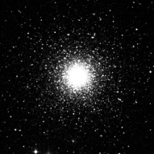  |M53 | NGC 5024 | | Ammasso globulare | 7,4 | 12,6' |
|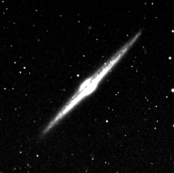 | | NGC 4565 | Galassia Ago | Galassia a spirale | 9,7 | 15,8' x 2,1' |

La Chioma di Berenice era davvero bella a vedersi. Dopo M3 nei Cani da Caccia ho proseguito su m53, per poi risalire sulla Galassia Ago: bellissima! Non mi sarei mai aspettato di vederla in questo modo, la sua forma perfettamente percepibile e la sua particolare angolazione, mi hanno letteralmente entusiasmato!

### Cancro - Cnc

| |Catalogo Messier | Catalogo NGC | Nome | Tipologia | Magnitudine apparente (v) | Dimensione apparente (v)
|----------- |----------- | ----------- | ----------- | ----------- | ----------- | ----------- |
| | M44 | NGC 2632 | Ammasso del presepe o alveare | Ammasso aperto | 3,1 | 95' |
| | M67 | NGC 2682 | | Ammasso aperto | 6,1 | 30'|

In questa fase la stanchezza cominciava a farsi sentire, ho deciso di rivedermi un po' m44 che mi restituisce sempre momenti piacevoli e rilassanti per poi virare su m67 che non avevo mai osservato.

### Leone - Leo

| |Catalogo Messier | Catalogo NGC | Nome | Tipologia | Magnitudine apparente (v) | Dimensione apparente (v)
| ----------- | ----------- | ----------- | ----------- | ----------- | ----------- | ----------- |
|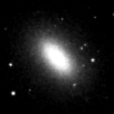 || NGC 3377 | | Galassia ellittica | 10,2 | 4,2' x 2,3' |
|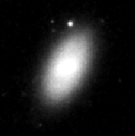 | | NGC 3412 | | Galassia lenticolare | 10,54 | 3,6' × 2,0' | 
|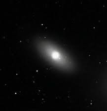 | | NGC 3384 | | Galassia ellittica | 10,9 | 5,5' x 2,5' | 
|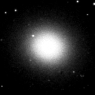 | M105 | NGC 3379 | | Galassia ellittica | 9,3 | 5,4' x 4,8' | 
| | | NGC 3389 | | Galassia a spirale | 12,4 | 2.7' x 1.3' | 
|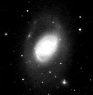 | M96 | NGC 3368 | | Galassia a spirale intermedia | 9,24 | 7,6' × 5,2' | 
|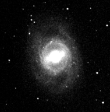 | M95 | NGC 3351 | | Galassia a spirale barrata | 9,7 | 7,4' × 5,1' |

È stata una bella maratona nel Leone, ho puntato al Gruppo di M96 di cui sono riuscito a vedere in totale 7 galassie. Qui la lucidità complice un po' di freddo iniziava a venir meno. Mi sono limitato ad osservarle, forse, ragionando a posteriori, anche un po' frettolosamente, senza prendere nessun particolare appunto.

### Serpente - Ser

| | Catalogo Messier | Catalogo NGC | Nome | Tipologia | Magnitudine apparente (v) | Dimensione apparente (v)
| ----------- | ----------- | ----------- | ----------- | ----------- | ----------- | ----------- |
|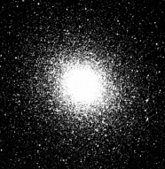 | M5 | NGC 5904 | | Ammasso globulare | 5,6 | 23' |

Ci avevo preso gusto con gli ammassi globulari. Purtroppo non ho preso appunti riguardo l'osservazione di M5.

### Vergine - Vir

| | Catalogo Messier | Catalogo NGC | Nome | Tipologia | Magnitudine apparente (v) | Dimensione apparente (v)
| ----------- | ----------- | ----------- | ----------- | ----------- | ----------- | ----------- |
|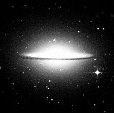 | M104 | NGC 5904 | Galassia sombrero | Galassia a spirale | 8,98 | 8,7' x 3,5' |

M104 altro oggetto top della serata, emozionato come un bambino nel vederla! Oltre a distinguerne la forma dopo aver abituato gli occhi era distinguibile una sottile linea oscura al centro che la tagliava in due.

### Ercole - Her

| | Catalogo Messier | Catalogo NGC | Nome | Tipologia | Magnitudine apparente (v) | Dimensione apparente (v)
| ----------- | ----------- | ----------- | ----------- | ----------- | ----------- | ----------- |
| 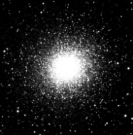 | M 13 | NGC 6205 | Ammasso Globulare di Ercole | Ammasso Globulare | 5,8 | 23' |
| 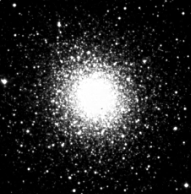 |M 92 | NGC 6341 | | Ammasso Globulare | 6,3 | 11,2' |

Bellissimo M13. In particolare si distinguevano alcune stelle che richiamavano il disegno di una spirale.

### Lira - Lyr

| | Catalogo Messier | Catalogo NGC | Nome | Tipologia | Magnitudine apparente (v) | Dimensione apparente (v)
| ----------- | ----------- | ----------- | ----------- | ----------- | ----------- | ----------- |
| 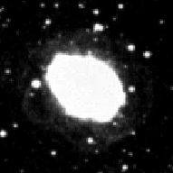 | M 57 | NGC 6720 | Nebulosa Anello | Nebulosa Planetaria | 9,7 | 230" x 230" |

Per finire ho voluto chiudere su m57, altra bellissima planetaria. Era chiaramente distinguibile l'anello con delle tenui sfumature interne. 

## Conclusioni

La soddisfazione è stata tanta ed inaspettata. Probabilmente la prossima voltà tenderò ad osservare molti degli oggetti di questa lista cercando di fare un'analisi migliore e più ragionata. Vorrei oltretutto trovare un metodo per appuntare in maniera veloce (avevo pensato anche a dei semplici disegni) gli oggetti osservati.

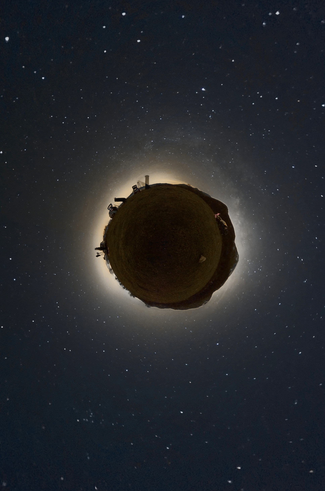 